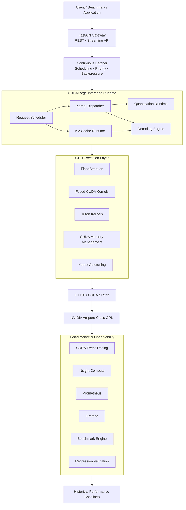

<div align="center">
<h1>CUDAForge</h1>
<h3><i>Production-Grade LLM Inference Runtime, GPU Kernel Optimization & Performance Engineering Platform</i></h3>

[](https://isocpp.org/)
[](https://developer.nvidia.com/cuda-toolkit)
[](https://github.com/triton-lang/triton)
[](https://pytorch.org/)
[](https://fastapi.tiangolo.com/)
[](https://www.docker.com/)
[](LICENSE)
</div>

---

# 📌 Executive Summary

Modern LLM inference is fundamentally a **systems problem**. High-throughput generation requires efficient GPU kernels, optimized memory movement, KV-cache management, dynamic request scheduling, precision-aware execution, profiling, and continuous performance validation.

**CUDAForge** is a production-grade LLM inference runtime and GPU experimentation platform that combines **C++20/CUDA low-level execution**, **Triton kernel optimization**, **paged KV-cache management**, **continuous batching**, **kernel autotuning**, **quantization**, **speculative decoding**, and **automated performance evaluation** into a unified inference stack.

Designed for high-performance AI infrastructure, CUDAForge focuses on the engineering challenges beneath modern LLM serving: GPU kernel execution, memory efficiency, scheduling, runtime optimization, reproducible benchmarking, and regression detection.

---

# 🚀 Key Performance Highlights

| Metric                    |             Result            | Optimization                     |
| :------------------------ | :---------------------------: | :------------------------------- |
| **Attention Latency P50** |          **4.68 ms**          | Fused FlashAttention execution   |
| **Attention Speedup**     |           **8.43×**           | GPU tiling + reduced HBM traffic |
| **Attention Throughput**  |        **58.83 TFLOPS**       | SRAM-aware block execution       |
| **KV-Cache Allocation**   |     **0.48 µs / request**     | Paged GPU memory management      |
| **Scheduler Throughput**  |        **15.35M tok/s**       | Non-blocking continuous batching |
| **Precision Paths**       | **FP16 / BF16 / INT8 / INT4** | Precision-aware execution        |

> Benchmarks target **NVIDIA Ampere (sm_86)** execution with FP16 inference workloads. Results are workload-dependent and benchmark-specific.

---

# 💡 Core Engineering Highlights

## ⚙️ AI/ML Systems Engineering

* **High-Performance Inference Runtime:** Engineered a low-level inference stack combining **C++20, CUDA, Triton, and PyTorch** for GPU-accelerated LLM execution.

* **Custom GPU Kernel Architecture:** Developed performance-critical CUDA/Triton execution paths including **FlashAttention-style kernels**, fused operations, and architecture-aware kernel dispatch.

* **Paged KV-Cache Runtime:** Implemented GPU-resident KV-cache management with **paged allocation, prefix reuse, eviction, and fragmentation control** to improve memory efficiency during generation.

* **Continuous Batching Engine:** Designed dynamic request scheduling with **admission control, token budgets, priorities, and backpressure** for high-throughput inference workloads.

* **Kernel Autotuning:** Built architecture-aware benchmarking and kernel-selection workflows to identify efficient execution configurations for NVIDIA GPUs.

---

## 📊 Performance Engineering & Evaluation

* **GPU Performance Benchmarking:** Built reproducible benchmark suites measuring **latency, throughput, memory usage, GPU utilization, kernel efficiency, and execution characteristics**.

* **Performance Regression Detection:** Implemented historical baseline comparison to automatically detect regressions rather than relying on manual benchmark inspection.

* **Numerical Correctness Validation:** Compared optimized GPU kernels against reference implementations to ensure performance improvements preserve numerical correctness.

* **Deep GPU Profiling:** Integrated **CUDA event tracing, memory analysis, and NVIDIA Nsight Compute** workflows for identifying kernel and memory bottlenecks.

* **Precision Evaluation:** Supports **FP16, BF16, INT8, and INT4** execution paths with validation of numerical behavior and performance trade-offs.

---

## 🏭 Production Infrastructure

* **GPU-Aware Serving:** Provides a **FastAPI-based REST/streaming inference layer** for production-style request execution.

* **Containerized GPU Runtime:** Supports reproducible deployment through **Docker and NVIDIA Container Toolkit**.

* **Observability:** Integrates **Prometheus and Grafana** for GPU, runtime, memory, and cache telemetry.

* **CI/CD Validation:** Includes automated formatting, unit testing, integration testing, and performance regression workflows.

* **Production Reliability:** Emphasizes explicit GPU capability validation, structured runtime errors, memory/OOM handling, deterministic benchmark configuration, and reproducible experiment metadata.

---

# 🏗 System Architecture


---

# 📁 Repository Structure

```text
CUDAForge/
├── .github/
│   └── workflows/
│       ├── ci-regression.yml       # Automated GPU regression CI pipeline
│       └── lint-and-format.yml     # Code format checks (Ruff, Black, Clang-Format)
├── benchmarks/
│   ├── baselines/
│   │   └── baseline_metrics.json   # Hardware baseline target latency metrics
│   ├── suite/
│   │   ├── bench_flash_attn.py     # FlashAttention vs PyTorch SDP benchmarking
│   │   └── bench_paged_kv.py       # Page table lookup & allocation benchmark
│   └── regression_runner.py        # CI/CD Regression test entrypoint
├── csrc/                           # C++20 / CUDA Source Code
│   ├── include/                    # Headers (block_allocator, paged_kv_cache)
│   └── src/                        # Implementations & Pybind11 bindings
├── cudaforge/                      # Python Core Package
│   ├── _C.so                       # Pybind11 Native Extension
│   ├── engine.py                   # Engine runtime interface
│   ├── profiler.py                 # CUDA Event & Memory leak detector
│   ├── quantization.py             # INT8/INT4 dequantization routines
│   └── speculative.py              # Speculative decoding implementation
├── docker/
│   ├── Dockerfile.gpu              # Multi-stage lightweight GPU build file
│   └── docker-compose.yml          # Container orchestration configuration
├── observability/                  # Telemetry & Monitoring
│   ├── grafana/dashboards/         # Prometheus Grafana visual dashboards
│   └── prometheus/prometheus.yml   # Metrics scraper config
├── profiling/                      # Deep Profiling Traces
│   ├── nsight_configs/
│   ├── cuda_event_tracer.py
│   └── memory_leak_detector.py
├── serving/                        # REST API Production Serving
│   └── api/v1/                     # FastAPI endpoint schemas & handlers
├── tests/                          # Test Suites
│   ├── cpp/                        # GoogleTest C++ unit tests
│   ├── integration/                # Integration test scripts
│   └── unit/                       # PyTest Python unit tests
└── workloads/                      # Benchmarking Workloads & Data Loaders
    ├── dataset_loader.py           # Workload trace replay
    └── error_analysis.py          # Quality drop and precision verification
```
---
# 🏛 Runtime Components

| Component                | Responsibilities                                                                     |
| :----------------------- | :----------------------------------------------------------------------------------- |
| **Inference Runtime**    | LLM execution, precision-aware inference, kernel dispatch, and runtime orchestration |
| **Attention Engine**     | Tiled FlashAttention and fused GPU execution                                         |
| **KV-Cache Runtime**     | Paged allocation, prefix reuse, eviction, and fragmentation control                  |
| **Batching Scheduler**   | Continuous batching, admission control, priorities, token budgets, and backpressure  |
| **Kernel Autotuner**     | CUDA/Triton search, benchmarking, and architecture-aware dispatch                    |
| **Quantization Runtime** | FP16/BF16/INT8/INT4 execution and numerical validation                               |
| **Decoding Engine**      | Sampling, speculative decoding, and prefix-aware generation                          |
| **Benchmark Engine**     | Latency, throughput, memory, kernel efficiency, and regression analysis              |
| **Observability**        | CUDA telemetry, GPU utilization, cache pressure, and runtime metrics                 |
| **Serving Layer**        | FastAPI REST/streaming inference and production request management                   |
| **Infrastructure**       | Docker GPU deployment, CI/CD, profiling, and performance validation                  |

---

# ⚡ Quickstart

## 1. Clone the Repository

```bash
git clone https://github.com/Bahaa-Labs/CUDAForge.git
cd CUDAForge
```

---

## 2. Prerequisites

CUDAForge is designed for **Linux + NVIDIA GPU** environments.

```text
Linux
NVIDIA GPU — Ampere-class or newer
CUDA Toolkit 12.1+
Python 3.10+
C++20-compatible compiler
CMake / Ninja
Docker
NVIDIA Container Toolkit
```

---

## 3. Launch with Docker

Build and start the GPU runtime:

```bash
docker compose -f docker/docker-compose.yml up --build
```

Verify that the container can access the GPU:

```bash
docker exec -it cudaforge-runtime nvidia-smi
```

---

## 4. Start the Inference API

The serving layer exposes a FastAPI-based inference endpoint.

```bash
curl -X POST http://127.0.0.1:8000/v1/generate \
  -H "Content-Type: application/json" \
  -d '{
    "prompt_tokens": [1,2,3,4,5,6,7,8],
    "max_new_tokens": 16,
    "temperature": 0.0
  }'
```

API documentation:

```text
http://127.0.0.1:8000/docs
```

---

# 🧪 Validation & Benchmarking

CUDAForge treats **performance as a first-class engineering requirement**.

### Unit Tests

```bash
pytest tests/unit/
```

### Integration Tests

```bash
pytest tests/integration/
```

### FlashAttention Benchmark

```bash
python3 benchmarks/suite/bench_flash_attn.py
```

### Paged KV-Cache Benchmark

```bash
python3 benchmarks/suite/bench_paged_kv.py
```

### Full Regression Suite

```bash
python3 benchmarks/regression_runner.py
```

The benchmark and regression pipeline evaluates:

```text
Latency       → P50 / P95 / P99
Throughput    → tokens/sec
Memory        → allocation / peak usage / fragmentation
GPU           → utilization / occupancy
Kernels       → execution time / efficiency
Quality       → numerical drift / correctness
```

Historical performance baselines are stored in:

```text
benchmarks/baselines/baseline_metrics.json
```

This allows optimization results to be measured against reproducible hardware baselines and prevents performance regressions from silently entering the runtime.

---

# 📈 Engineering Philosophy

CUDAForge is built around one principle:

> **LLM inference performance is a systems problem, not just a model problem.**

The runtime therefore treats the complete inference path as an optimization surface:

```text
Model
  ↓
Kernel Selection
  ↓
Memory Movement
  ↓
KV-Cache Management
  ↓
Request Scheduling
  ↓
GPU Execution
  ↓
Telemetry
  ↓
Statistical Evaluation
  ↓
Regression Validation
```

This approach allows kernel-level improvements to be evaluated in the context of the complete inference system rather than as isolated microbenchmarks.

---

# 🧠 Why CUDAForge

CUDAForge sits at the intersection of:

**LLM Inference × GPU Programming × Systems Engineering × Machine Learning × Performance Science**

Rather than simply wrapping an existing inference server, the project focuses on the infrastructure underneath high-performance inference:

```text
Python
  ↓
C++20
  ↓
CUDA / Triton
  ↓
GPU Memory
  ↓
Kernel Execution
  ↓
Inference Runtime
  ↓
Scheduling & Serving
  ↓
Profiling & Observability
  ↓
Performance Evaluation
```

The goal is to make inference systems **faster, measurable, reproducible, tunable, and protected against regression**.

---

# 🛡 Production Engineering

CUDAForge is structured around production-oriented engineering practices:

* Deterministic benchmark configuration
* Explicit GPU capability validation
* Automated performance baselines
* Numerical correctness checks
* Structured runtime errors
* Explicit memory/OOM handling
* GPU-aware containerization
* CI/CD validation
* Reproducible experiment metadata
* Profiling-driven optimization
* Hardware-aware kernel selection

The objective is not simply to make a benchmark faster once.

The objective is to build a runtime where performance improvements can be **reproduced, measured, validated, and protected against regression**.

---

# 📜 License

CUDAForge is distributed under the **MIT License**.

See the [LICENSE](LICENSE) file for more information.


